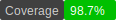

# slip-mongo

SLIP-Mongo is a set of MongoDB APIs for SLIP.

The concepts follow those found in the driver package at
[go.mongodb.org/mongo-driver/mongo](go.mongodb.org/mongo-driver/mongo). To
start, a connection is made to a mongodb database. Collections are
then used to access or query the records in the database.

## Notes

### Type Conversions

MongoDB is based on bson data. In this package the bson data is mapped
to SLIP bag instances which for most purposes can be thought of as
JSON data.

### Controlling Data Types

Basic type such as fixnums or strings map to go types of int64 and
string and will be inserted into mongo as bson long and bson
strings. To convert to different values the bson types the mongo
converters such as
[`$toDate`](https://www.mongodb.com/docs/manual/reference/operator/aggregation/toDate)
can be used.
